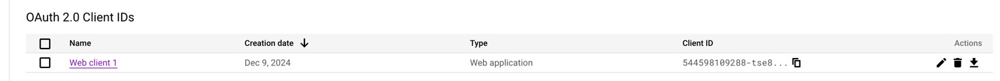
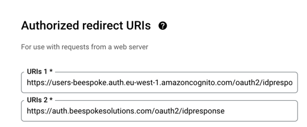

# How to create a new Product in HexLabs

1. Create Domain

2. Create AWS Accounts and GCP Projects
```shell
    npx @hexlabs/hexlabs-cli create
```

3. Create User service
```shell
    yo @hexlabs/hexlabs-api 
    select type User Service
```
4. Goto GCP and select project per environment created in step 2. Setup OAuth2 Client with redirect urls matching the domain for the environment setup in the previous steps:





5. Set the following secrets in the github actions for the stack projects for the ui (per env):
```shell
CLIENT_GOOGLE_ID_PRODUCTION
CLIENT_GOOGLE_SECRET_PRODUCTION
```

6. Create Web app (Generates two projects: a stack and react app)
```shell
    yo @hexlabs/hexlabs-api 
    select type React UI
```

7. Create Services
```shell
    yo @hexlabs/hexlabs-api 
    select type General Service
```
